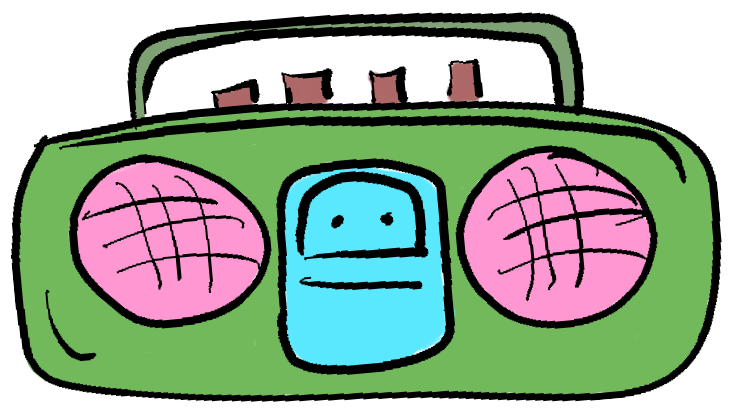
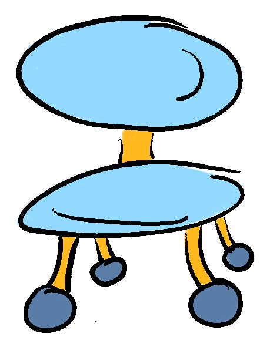
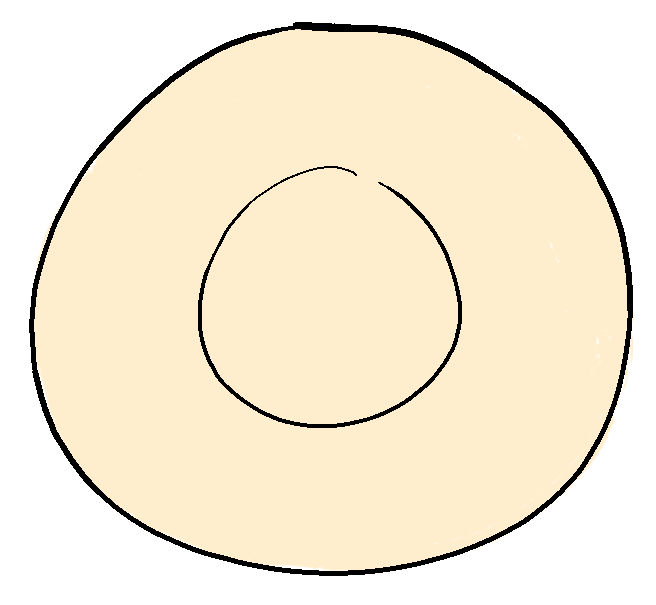
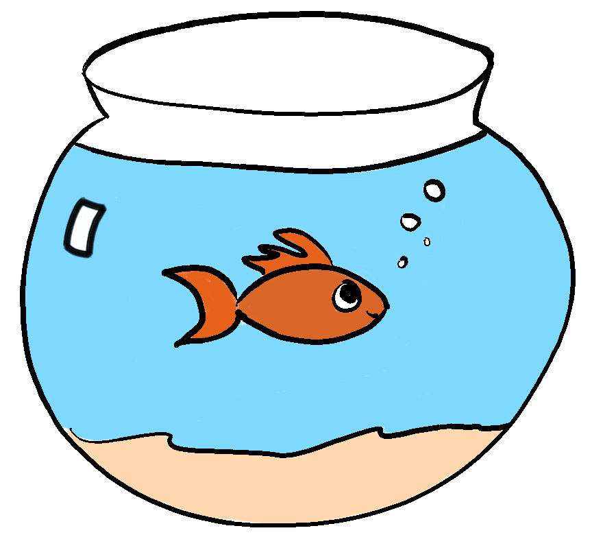
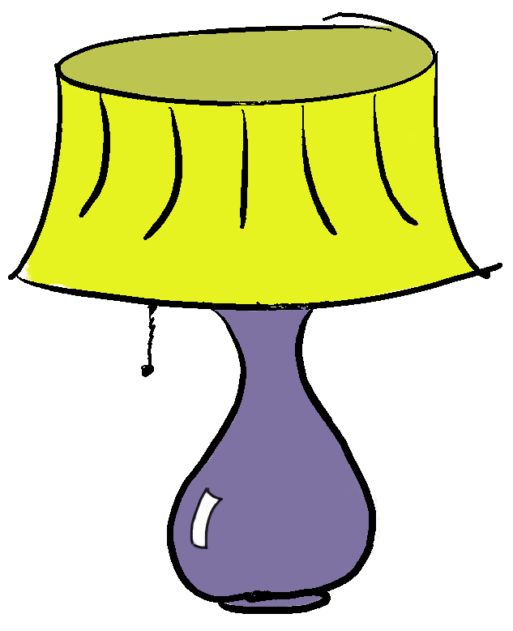
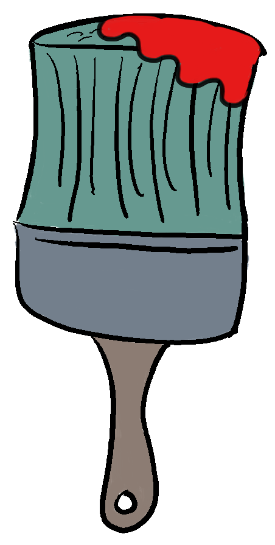
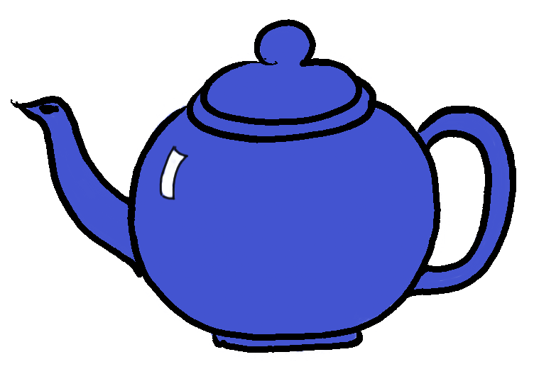
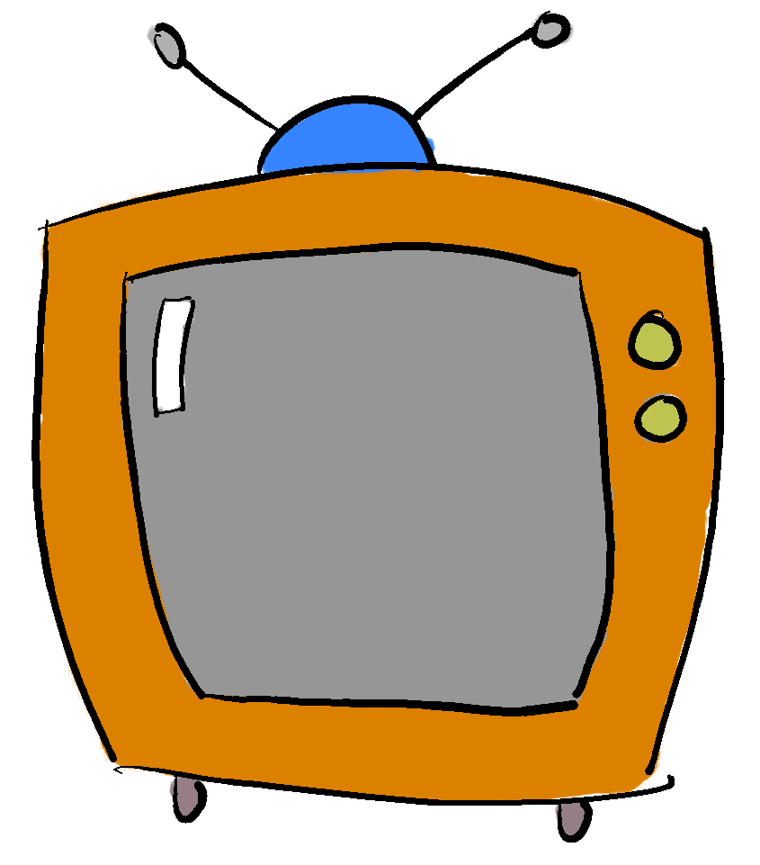
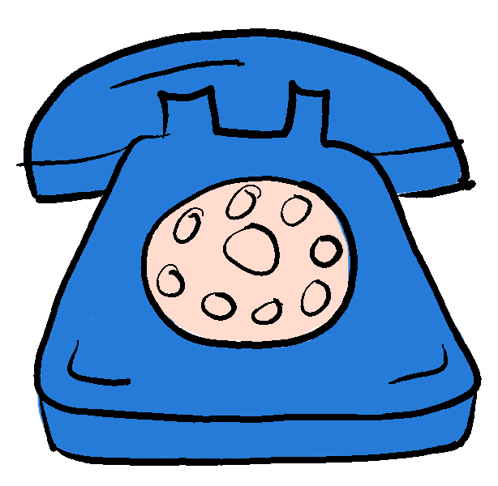

# Free images

This repo contains png files with a transparent and white background as well as the Affinity Photo file and a Photoshop version. Everything should be editable.

I drew all of these with the intention of having images to use in sample apps, blog posts, etc. with no strings attached. These are all free to use commercially or for personal projects, no attribution required or requested.

The images are:

 

 

 

 

 

 

 

### Paint is removable in Affinity and PS files.

 

 

I used a [Remarkable](https://remarkable.com/) tablet to draw these and then [Affinity Photo](https://affinity.serif.com/en-gb/photo/) (an superior alternative to PS without an ongoing bill) to color them and export everything.

